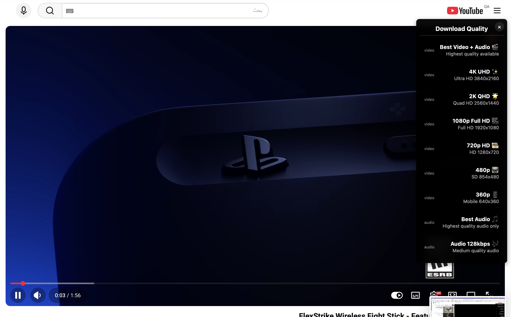

# 🚀 SafarGet: The Ultimate macOS Download Ecosystem

SafarGet isn't just a download manager; it is the **only** all-in-one ecosystem for macOS that bridges the gap between web browsing and local storage. Engineered for power users, it combines high-velocity multi-threading, native BitTorrent support, and a seamless YouTube extraction engine into one stunning interface.

[**🌐 Visit Official Website**](https://www.safarget.com) | [**📥 Download Now**](https://www.safarget.com/download)

---
## 🖼️ Screenshots

### Main Interface

### Download Bar & System Integration

### Browser Extensions

### Torrent & Media Management

---

## ✨ Key Features

### 🚀 Turbo-Charged Downloads
- **Hyper-Threading:** Multi-connection segmented downloading for maximum bandwidth utilization.
- **Smart Resume:** Advanced error recovery to resume interrupted downloads.
- **Large File Optimization:** Rock-solid stability even for 100GB+ files.

### 🔗 Universal Link Handling (The SafarGet Edge)
SafarGet is the only tool built entirely around the "Link Workflow." It intelligently captures and processes:
- **Direct Links:** Fast-lane downloading for servers.
- **Streaming Media:** Automatic detection of video/audio streams.
- **BitTorrent:** Full support for `.torrent` files and Magnet links.
*No more switching between 3 different apps; SafarGet handles everything.*

---

### 📥 Pro-Grade Torrent Support
- **Native Engine:** No need for external clients like uTorrent or Transmission.
- **Clean Management:** Manage peers, seeds, and files within the same UI.
- **Lightweight:** Minimal CPU/RAM impact compared to traditional clients.

### 🎬 Online Video Excellence
- **Platform Agnostic:** Download from YouTube and other supported platforms.
- **UHD Quality:** Choose your resolution (4K, 2K, 1080p) or extract high-quality audio (MP3/M4A).
- **Batch Processing:** Handle multiple video links simultaneously.

---

### 🧠 Deep macOS Integration
- **Extension Suite:** Native extensions for **Safari** and **Chrome**.
- **Apple Silicon Native:** Optimized for M1, M2, and M3 chips, with full support for Intel-based Macs.
- **Menu Bar Utility:** Monitor speeds and progress at a glance without opening the app.

---

## 🧩 Why SafarGet?

Most macOS download managers are either outdated, built on slow cross-platform frameworks (Electron), or limited to one type of file. 

**SafarGet changes the game by offering:**
1. **A Single Source of Truth:** One app for Torrents, Videos, and Direct links.
2. **Native Performance:** Written specifically for macOS to ensure speed and low battery drain.
3. **Seamless Workflow:** If it’s a link, SafarGet knows what to do with it.

---

## 💻 System Requirements

- **OS:** macOS 12.0 (Monterey) or later.
- **Architecture:** Apple Silicon (Universal) & Intel.
- **Browser:** Safari, Chrome, or Edge (for extension support).

---

## 🔒 Privacy & Security

- **Local Processing:** Your download history and data stay on your Mac.
- **No Bloatware:** Clean installation with no hidden background processes.
- **Secure:** Verified for macOS security standards.

---

## 📄 License & Feedback

SafarGet is proprietary software. This repository is dedicated to documentation, community feedback, and issue tracking.

**Found a bug?** Please [Open an Issue](https://github.com/your-repo/issues).
