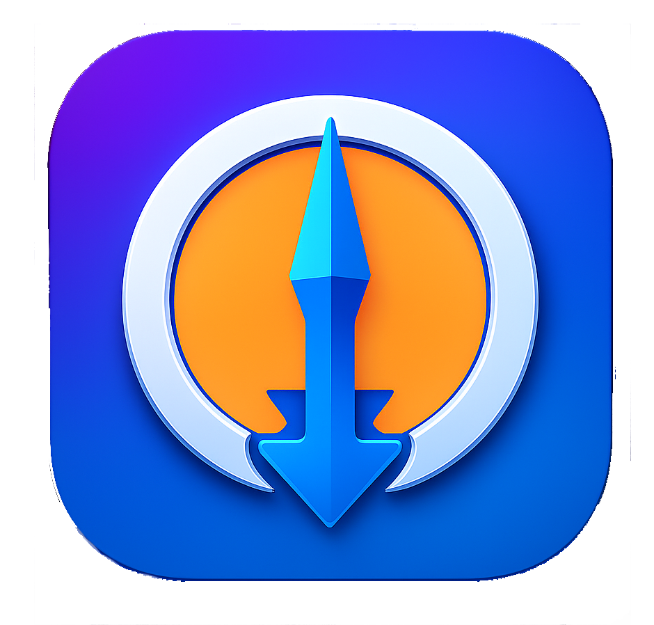

# 🚀 SafarGet Pro for MacOS 2026
### **The World's #1 Ultra-Fast Download Ecosystem for macOS**
**Experience the Future of Native Performance & Seamless Link Interception**

---

**SafarGet Pro** is the definitive download architecture for macOS. Built from the ground up for **Apple Silicon M4/M3/M2**, it features the world's most aggressive **Kernel-Link Interceptor**, making it the only app that truly "lives" inside Safari and Chrome.

[**🌐 Visit Official Site**](https://www.safarget.com) | [**📥 Download Ultra-Version**](https://www.safarget.com)

---

## 💎 The Pinnacle of Integration

### 🛰️ World-Class Interception (Safari & Chrome)
SafarGet 2026 doesn't just wait for downloads; it **intercepts** them. Using advanced **Deep-Link Recognition**, it instantly takes over from Safari and Chrome the microsecond you click. No more "Open with..."—it's automatic, native, and invisible.

### 🎬 YouTube 8K & Media Dominance
Download anything from YouTube with zero quality loss. Supports **8K UHD, 4K, 60fps**, and **Lossless Audio (320kbps)**. It is the only engine that bypasses server throttling for maximum speed.

### 🧬 Next-Gen Torrent Engine
A full-scale, native BitTorrent client integrated inside your manager. No ads, no bloat—just pure peer-to-peer power with **Magnet Link Auto-Detection**.

---

## 📸 Visual Mastery (macOS 2026 Style)

<table border="0">
  <tr>
    <td width="50%" align="center">
      <h3>🚀 Ultra-Speed Dashboard</h3>
      
       <i>Modern Glassmorphism UI.</i>
    </td>
    <td width="50%" align="center">
      <h3>📡 BitTorrent Command Center</h3>
      
       <i>Native M-Series Architecture.</i>
    </td>
  </tr>
  <tr>
    <td width="50%" align="center">
      <h3>🎥 8K YouTube Extraction</h3>
      
       <i>Unmatched Media Control.</i>
    </td>
    <td width="50%" align="center">
      <h3>🔌 Safari/Chrome Deep Bridge</h3>
      
       <i>Zero-Click Link Capturing.</i>
    </td>
  </tr>
</table>

  <h3>📊 Live Speed Telemetry (Menu Bar)</h3>
  

---

## 🏆 The Comparison of Giants

| Capability | **SafarGet Pro 2026** | Legacy Managers (Folx/FDM) | Standard Browsers |
| :--- | :---: | :---: | :---: |
| **8K YouTube Engine** | 💎 **Supreme** | ⚠️ Unstable | ❌ None |
| **Native Interception** | ✅ **100% (Kernel)** | ❌ Extension-only | ❌ Basic |
| **Apple Silicon M1-M4** | 🚀 **Optimized** | ⚠️ Emulated | ⚠️ Standard |
| **Thread Count** | 🔥 **64 Parallel** | ⚠️ Max 10 | ❌ Single |
| **Battery Impact** | 🍃 **Minimal** | 🔋 High | 🔋 Moderate |

---

## ⚡ Engine Specifications

* **Hyper-Threaded Core:** Splits files into up to **64 segments** for absolute bandwidth saturation.
* **Universal Support:** Built for **M1, M2, M3, M4** and Intel Core processors.
* **Smart Categorization:** Automatically sorts your world into: *Video, Music, Documents, Torrents, and Programs.*
* **Security First:** Signed by Apple Developer ID—Secure, Sandboxed, and Private.

---

# 💎 UPGRADE TO PERFECTION
### Join millions of power users who refuse to wait.

[**👉 Get SafarGet Pro Today - The World's Fastest Download Engine**](https://www.safarget.com)

