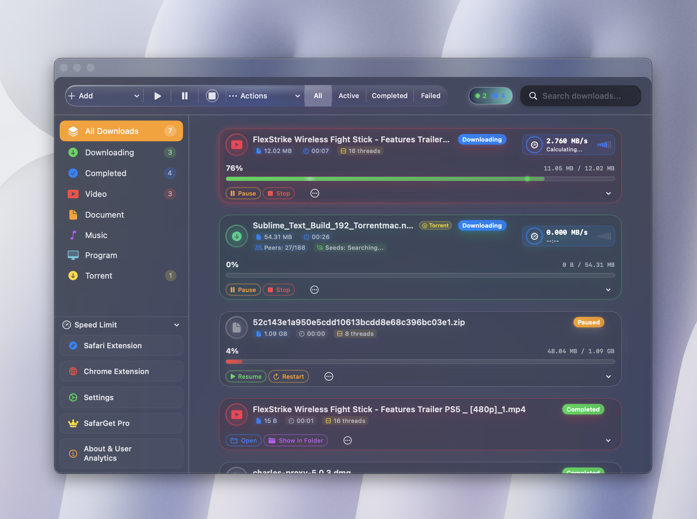
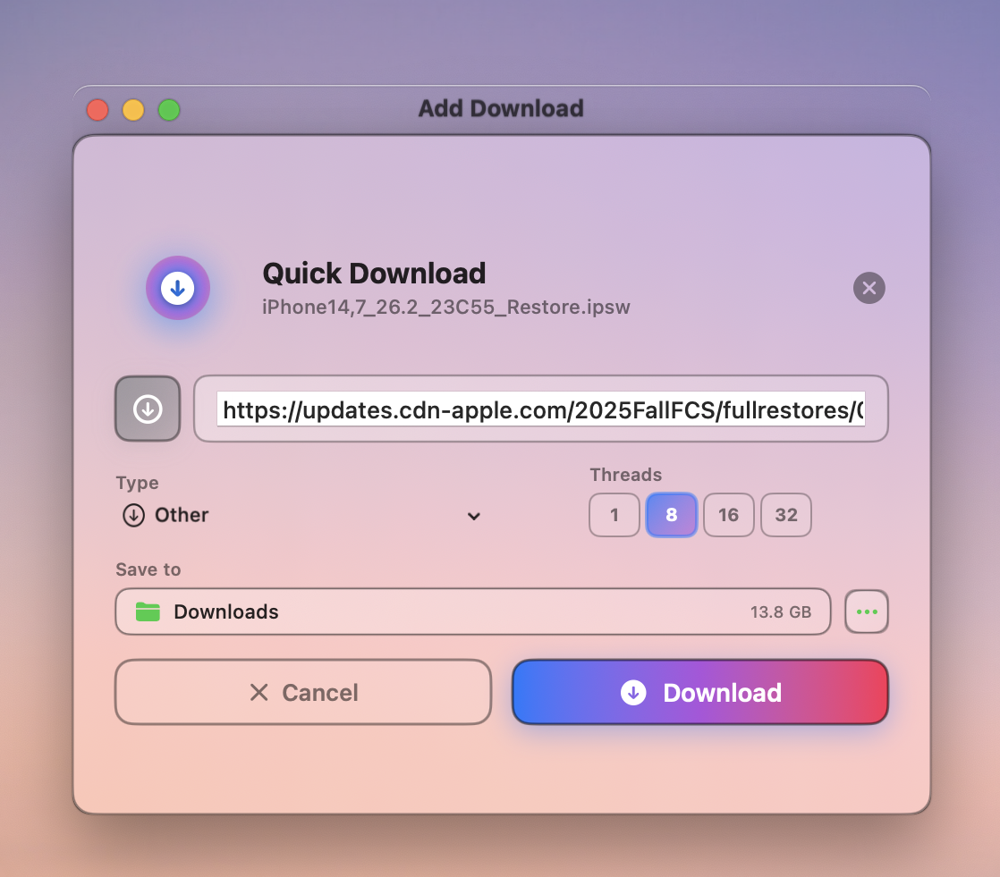
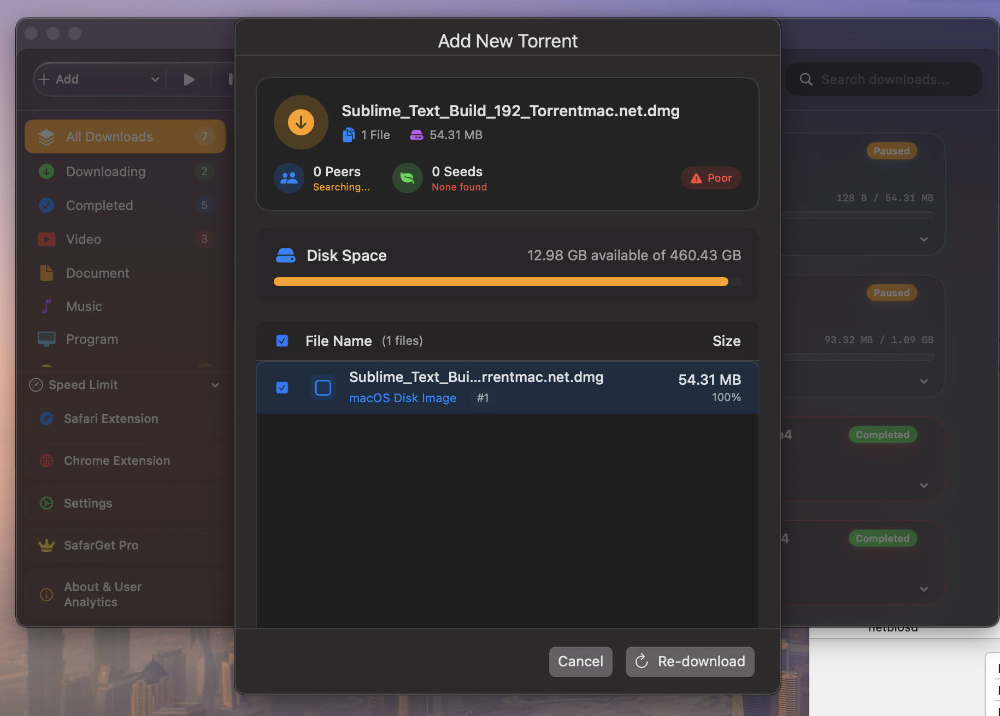
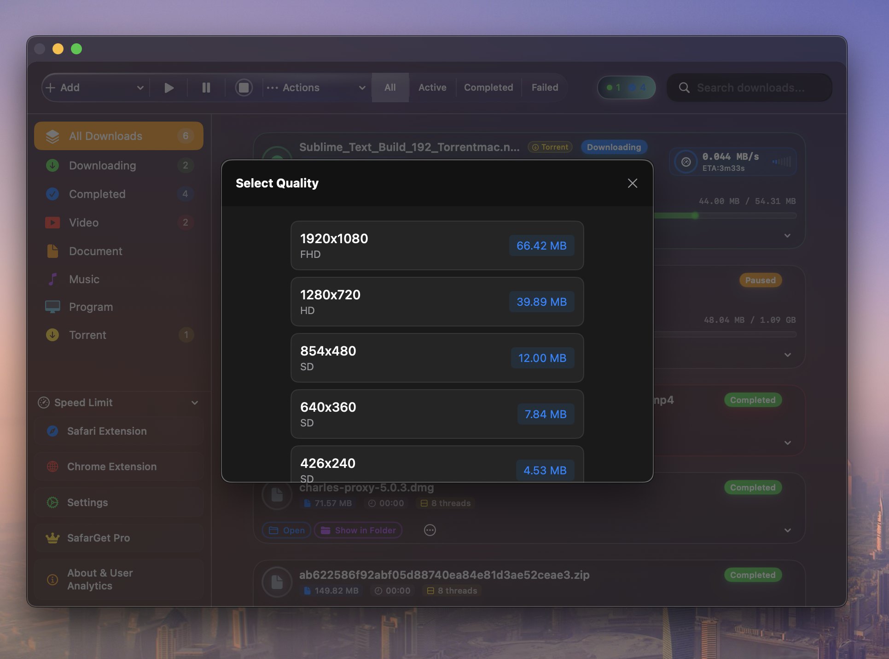

# SafarGet
SafarGet isn't just a download manager; it is the only all-in-one ecosystem for macOS that bridges the gap between web browsing and local storage. Engineered for power users, it combines high-velocity multi-threading, native BitTorrent support, and a seamless YouTube extraction engine into one stunning interface.

Visit Official Website → https://www.safarget.com
 
--

## 🖼️ Screenshots

### Main Interface

### Download Bar

### Safari Extension

### YouTube Extension

### Torrent Support

### YouTube Download

--
## ✨ Key Features

### 🚀 Accelerated Downloads
- Multi-connection segmented downloading for faster speeds
- Smart resume support
- Stable performance even with large files

### 🔗 Universal Link Handling
SafarGet is built around links.
It can intelligently handle different types of links within one workflow:
- Direct file download links
- Streaming media links
- Magnet and torrent links

No need to switch between multiple apps.

--

### 📥 Torrent Support
- Native torrent handling
- Clean and simple torrent management
- No external torrent client required

---

### 🎬 Online Video Downloads
- Download videos from supported platforms
- Multiple quality and format options
- Designed for personal and offline use

> Users are responsible for how downloaded content is used.

---

### 🧠 Smart Integration
- Safari & Chrome browser integration
- Automatic link detection
- One-click download initiation

---

### 🍎 Native macOS Experience
- Built specifically for macOS (not Electron)
- Optimized for Apple Silicon (M1 / M2 / M3) and intel 
- Clean, modern macOS-style UI
- Low system resource usage

---

## 🧩 Why SafarGet?

Most download managers on macOS are either:
- Limited in functionality
- Built using cross-platform frameworks
- Focused on a single type of download

SafarGet aims to be different by offering:
- A single, integrated solution
- Native performance
- A workflow centered around links — not file types

---

## 💻 System Requirements

- macOS 12 or later
- Apple Silicon (Intel support may be limited)
- Internet connection

---

## 🧪 Testing & Feedback

SafarGet is actively developed.

Feedback from macOS users is highly appreciated:
- Feature requests
- Bug reports
- Performance observations

Please use **GitHub Issues** to share your feedback.

---

## 🔒 Privacy & Security

- No hidden background processes
- No unnecessary data collection
- User data remains local unless explicitly required for functionality

---

## 🌐 Website

https://www.safarget.com

---

## 📄 License

SafarGet is proprietary software.  
This repository is used for documentation, issue tracking, and community feedback.
